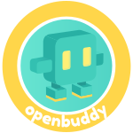

<p align="center">
  <a href="../README.md">English</a> ·
  <a href="README.zh.md">中文</a> ·
  <a href="README.ja.md">日本語</a> ·
  <a href="README.es.md">Español</a>
</p>

<p align="center">
  
</p>

<h1 align="center">OpenBuddy</h1>

<p align="center">
  <em>Une IA amusante et facile — mettre les outils les plus puissants entre les mains des esprits les plus curieux</em>
</p>

<p align="center">
  <a href="https://openbuddy.fun"></a>
  <a href="../LICENSE"></a>
  
  
  
  
</p>

<p align="center">
  <a href="https://youtu.be/PxPKkh4E9-Y">
    
  </a>
  <br>
  <em>▶ <a href="https://youtu.be/PxPKkh4E9-Y">Voir la démo sur YouTube</a></em>
</p>

---

## Qu'est-ce qu'OpenBuddy ?

OpenBuddy est un système d'animal de compagnie de bureau pour Claude Code construit sur des appareils **M5Stack ESP32-S3**. Il apporte l'interaction vocale avec l'IA sur votre bureau grâce à un adorable compagnon animé qui écoute, réfléchit et parle — le tout propulsé par Claude Code.

Deux variantes matérielles sont prises en charge : **Cardputer** (écran LCD rectangulaire) et **StopWatch** (AMOLED circulaire). Une architecture à trois couches — firmware ESP32 ↔ backend Python ↔ WebUI React — connecte le tout en temps réel via WebSocket.

## Fonctionnalités

- 🗣️ **Interaction vocale** — appuyez sur un bouton, parlez naturellement, obtenez une réponse vocale. Pipeline complet STT → Agent → TTS
- 🐾 **Animation de mascotte** — 6 états animés : inactif, écoute, réflexion, parole, erreur, déconnecté
- 🔌 **Intégration Claude Code** — se connecte en temps réel aux événements du cycle de vie de Claude Code (Stop, PreToolUse, PostToolUse, Notification)
- 🌐 **Tableau de bord web** — configurez les paramètres, visualisez les transcriptions en direct, explorez les fichiers, gérez les prompts
- 📡 **Découverte automatique** — découverte de services mDNS via `openbuddy.local`, aucune configuration IP manuelle
- 🎯 **Support bi-appareil** — un seul serveur alimente Cardputer et StopWatch simultanément
- 🔊 **Voix bilingue** — sélection automatique de la voix chinoise ou anglaise selon le contenu du texte

## Architecture

```
┌─────────────┐       WebSocket        ┌─────────────────┐       WebSocket       ┌─────────────┐
│  ESP32       │◄──── /ws/openbuddy ───►│  Python Server   │◄──── /ws/webui ──────►│  React       │
│  Device      │      (binary+JSON)     │  (FastAPI)       │      (JSON events)    │  WebUI       │
└─────────────┘                         └────────┬────────┘                        └─────────────┘
                                                 │
                                          Voice Pipeline
                                                 │
                             ┌───────────────────┼───────────────────┐
                             ▼                   ▼                   ▼
                     ┌──────────────┐   ┌──────────────┐   ┌──────────────┐
                     │ STT          │   │ Agent        │   │ TTS          │
                     │ ElevenLabs   │──►│ LLM via      │──►│ ElevenLabs   │
                     │ Scribe v2   │   │ claude-agent  │   │ Eleven v3    │
                     └──────────────┘   │ -sdk         │   │ PCM16/16kHz  │
                                        └──────────────┘   └──────────────┘
```

**Pipeline vocal (chaîne F3) :**

```
🎤 Micro → STT (ElevenLabs Scribe v2) → Nettoyage Qwen → Agent → Nettoyage Qwen → TTS (ElevenLabs v3) → 🔊 Haut-parleur
```

## Appareils compatibles

| Caractéristique | Cardputer | StopWatch |
|-----------------|-----------|-----------|
| Écran | 1.14" ST7789 LCD 320×240 | AMOLED circulaire |
| Flash | 8 Mo | 16 Mo |
| PSRAM | — | Externe OCT 80 MHz |
| Framework UI | smooth_ui_toolkit | LVGL v9 |
| Codec audio | ES8311 (I²S) | ES8311 (I²S) |
| ESP-IDF | 5.4.2 | 5.5.4 |

## Démarrage rapide

### 1. Cloner le dépôt

```bash
git clone https://github.com/lennonkc/openbuddy.git
cd openbuddy
```

### 2. Démarrer le serveur et la WebUI

```bash
make dev
# Serveur sur :8000 · WebUI sur :5173
```

### 3. Configurer les clés API

Ouvrez http://localhost:5173 → panneau **Settings**, ou utilisez la ligne de commande :

```bash
keyring set openbuddy elevenlabs <key>   # STT + TTS
keyring set openbuddy dashscope <key>    # Nettoyage de texte Qwen
keyring set openbuddy llm <key>          # Agent LLM
```

### 4. Configurer les hooks Claude Code

Ajoutez ce qui suit dans `~/.claude/settings.json` :

```json
{
  "hooks": {
    "Stop": [{ "matcher": "", "hooks": [{
      "type": "command",
      "command": "curl -m 1 -X POST -H 'Content-Type: application/json' -d @- http://127.0.0.1:8000/hooks/Stop &"
    }]}]
  }
}
```

Appliquez le même schéma pour `UserPromptSubmit`, `PreToolUse`, `PostToolUse`, `Notification` et `SessionStart`. Le hook `Stop` doit être en mode fire-and-forget (timeout court + `&` en arrière-plan) pour éviter les blocages.

### 5. Flasher le firmware (optionnel)

```bash
source ~/esp/esp-idf/export.sh
make fw-stopwatch    # StopWatch
```

## Commandes

| Commande | Description |
|----------|-------------|
| `make dev` | Démarrer le serveur (:8000) + WebUI (:5173) |
| `make server` | Démarrer le serveur uniquement |
| `make webui` | Démarrer la WebUI uniquement |
| `make test` | Exécuter tous les tests |
| `make lint` | Exécuter le linter Python ruff |
| `make fw-stopwatch` | Compiler, flasher et surveiller le firmware StopWatch |

## Configuration

| Élément | Emplacement |
|---------|-------------|
| Clés API | Trousseau macOS via `keyring` (service = `openbuddy`) |
| Configuration de l'app | `~/.config/openbuddy/config.json` |
| Prompts personnalisés | `~/.config/openbuddy/prompts.json` |
| Journaux | `~/.cache/openbuddy/` |

## Structure du projet

```
openbuddy/
├── openbuddy_server/    # Backend Python FastAPI
│   ├── voice/           #   Pipeline vocal (STT, TTS, Qwen)
│   ├── agent/           #   Cycle de vie de l'Agent et nettoyage
│   ├── ws/              #   Points de terminaison WebSocket
│   └── api/             #   Routes de l'API REST
├── openbuddy_webui/     # React WebUI (Vite + TypeScript + Tailwind)
├── stopwatch/           # Firmware StopWatch ESP32-S3
└── openbuddy_fun/       # Page de présentation (openbuddy.fun)
```

## Contribuer

```bash
make lint    # Python : ruff check + format
make test    # pytest + vitest
```

- Python : ruff (line-length=100)
- TypeScript : ESLint avec alias de chemin `@/`
- Firmware : ESP-IDF CMake, espaces de noms C++ par application

## Licence

[MIT](../LICENSE)

## Liens

- 🌐 Site web : [openbuddy.fun](https://openbuddy.fun)
- 📦 GitHub : [lennonkc/openbuddy](https://github.com/lennonkc/openbuddy)
